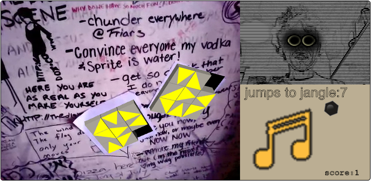

A #ggo13 entry. This is what happens when a undirected mind writes a game. Teh result of searching for a game mechanic by hoping for accidents. Various game objects and abandoned ideas are hidden behind a wall of commits. A month of hopeless thrashing around --- with moments of optimistic exultation and periods of empty surrender.

## The Game
In this game you chase a character around by solving 8-puzzles. You are armed with a Jingleball which triggers a Jangle after a number of Jumps. If the Jangle occurs in the same scene as the Strawman then you earn a point and the level advances. The path of the Jingleball is blocked if its target hole is not a solved 8-puzzle. And the Jangleball fizzles out if it runs out of jumps.
